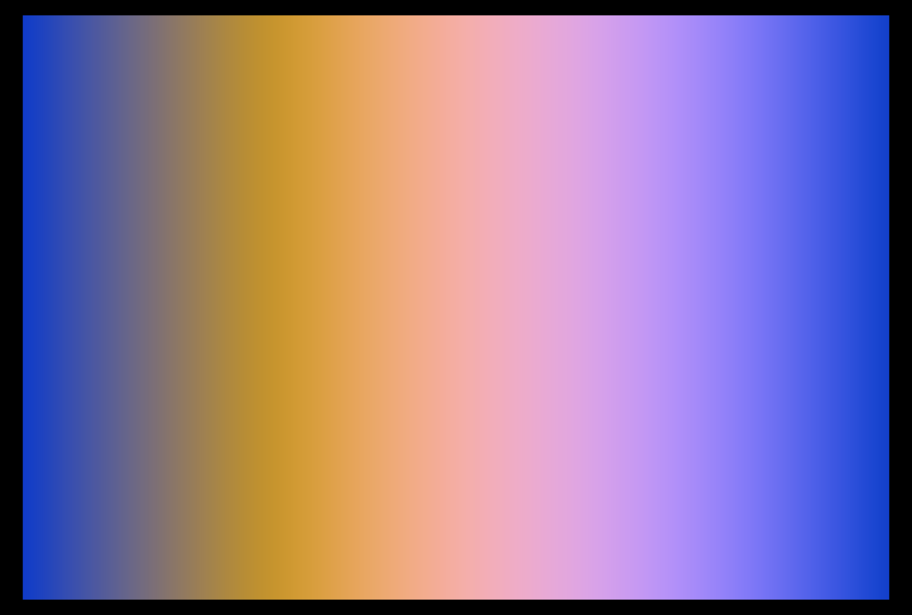

#### fragment

### Summary

the `palette()` function from that `kishimisu` video on YT is a gift that just keeps, on giving.



```rust
@fragment
fn fragment(in: MeshVertexOutput) -> @location(0) vec4<f32> {
    let uv = in.uv;

    let col = palette(uv.y + globals.time * 0.2);

    return vec4<f32>(col, 1.0);
}

fn palette(t: f32) -> vec3<f32> {
    let a = vec3<f32>(0.5, 0.2, 0.5);
    let b = vec3<f32>(0.5, 0.2, 0.5);
    let c = vec3<f32>(1.0, 0.8, 1.0);
    let d = vec3<f32>(0.263, 0.416, 0.557);

    return a + b * cos(6.28318 * (c * t + d));
}


```
