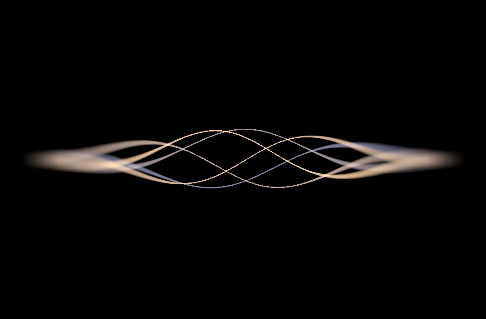

### Summary

This one turned out really, really well.



### fragment

```rust
@fragment
fn fragment(in: MeshVertexOutput) -> @location(0) vec4<f32> {
    let uv = (in.uv * 2.0) - 1.0;
    var col = vec4f(0.0);


    for (var i = 0.0; i <= NUM_LINES; i += 1.0) {
        let t = i / INTENSITY;
        col += line(uv, SPEED + t, HEIGHT + t, vec3f(0.2 + t * 0.7, 0.2 + t * 0.4, 0.3));
    }

    return col;
}

fn line(uv: vec2f, speed: f32, height: f32, col: vec3f) -> vec4f {
    var uv = uv;
    uv.y += smoothstep(1.0, 0.0, abs(uv.x)) * sin(globals.time * speed + uv.x * height) * 0.2;
    return vec4(smoothstep(.06 * smoothstep(.2, .9, abs(uv.x)), 0., abs(uv.y) - .004) * col, 1.0) * smoothstep(1., .3, abs(uv.x));
}


```
